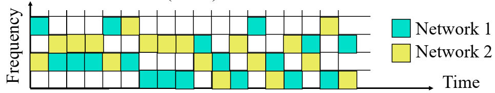

# ความเป็นมาของ Bluetooth
## จุดเริ่มต้น
- มีจุดเริ่มต้นมาจากโครงการ Bluetooth ของ Ericsson ในปี 1994 สำหรับการสื่อสารทางวิทยุระหว่างโทรศัพท์มือถือในระยะทางสั้น

- ตั้งชื่อตามกษัตริย์เดนมาร์ก Herald Blatand (ค.ศ. 940-981) ผู้ทรงชื่นชอบบลูเบอร์รี่

- Intel, IBM, Nokia, Toshiba และ Ericsson ก่อตั้ง Bluetooth SIG ในเดือนพฤษภาคม 1998

- ข้อกำหนดเวอร์ชัน 1.0A ออกมาในช่วงปลายปี 1999

- IEEE 802.15.1 ได้รับการอนุมัติในช่วงต้นปี 2002 มีพื้นฐานมาจาก Bluetooth เวอร์ชันหลังๆ จัดการโดย Bluetooth SIG โดยตรง

### คุณสมบัติหลัก
- พลังงานต่ำ: 10 mA ในโหมดสแตนด์บาย 50 mA ขณะส่งสัญญาณ

- ราคาถูก: ไม่เกิน 5 เหรียญสหรัฐต่ออุปกรณ์

- ขนาดเล็ก: ชิปเดี่ยวขนาด 9 ตร.มม.

## รุ่นของ Bluetooth ในอดีต

รุ่น|รายละเอียด
--|--
Bluetooth 1.1|IEEE 802.15.1-2002
Bluetooth 1.2| IEEE 802.15.1-2005. Completed Nov 2003. Extended SCO, Higher variable rate retransmission for SCO + Adaptive frequency hopping (avoid frequencies with interference).
Bluetooth 2.0 + Enhanced Data Rate (EDR) (Nov 2004)| 3 Mbps using DPSK. For video applications. Reduced power due to reduced duty cycle
Bluetooth 2.1 + EDR (July 2007)| Secure Simple Pairing to speed up pairing
Bluetooth 3.0+ High Speed (HS) (April 2009)| 24 Mbps using WIFI PHY + Bluetooth PHY for lower rates
Bluetooth 4.0 (June 2010)| Low energy. Smaller devices requiring longer battery life (several years). New incompatible PHY. Bluetooth Smart or BLE
Bluetooth 4.1| 4.0 + Core Specification Amendments (CSA) 1, 2, 3, 4
Bluetooth 4.2 (Dec 2014)| Larger packets, security/privacy, IPv6 profile


## Bluetooth 5

### Release date
June/December 2016
### Features 
- Enhanced Bluetooth low energy
- รองรับอุปกรณ์ low energy มากมาย เช่น 
   - หูฟัง
   - Dual-audio: หูฟังสองตัวเล่นสัญญาณเสียงสองช่องพร้อมกัน
   - ความเร็วข้อมูล 2 เท่า โดยใช้การมอดูเลชั่นแบบใหม่  ทำให้ได้ความเร็วถึง 2 Mbps หรือระยะทางเพิ่มเป็น  4 เท่า หรือ 800 ฟุต เมื่อใช้วิธีการเข้ารหัสแบบพิเศษ 
   - ใน Long-Range mode มีระยะรับส่งไกลถึง 1.6 กิโลเมตรที่ความเร็ว 125 kbps
   - เพิ่มขีดความสามารถในการออกอากาศ 8 เท่า โดยเปลี่ยนขั้นตอนการ  advertising เป็น 255B แทนที่จะเป็น 31B ใน v4.2
   - การบีบอัดแบบ aptX ช่วยให้เสียงมีคุณภาพระดับ CD มากกว่าที่ความเร็วข้อมูลสูงกว่า 1 Mbps ส่วน Bluetooth 5.0 ช่วยให้คุณภาพเสียงดีขึ้นโดยใช้ความเร็ว 2 Mbps
   - กำลังส่ง +20 dBm ในโหมด LE เหมาะสำหรับการส่งแบบต่อเนื่อง
   - มีความเข้ากันได้กับอุปกรณ์รุ่นเก่าที่ใช้โหมดรุ่นเก่า
   - ถ้าทั้งสองฝั่งเป็น Bluetooth 5 จะได้ประโยชน์เต็มที่
   

## รายละเอียด Bluetooth

คุณสมบัติ | รายละเอียด
-|- 
Frequency Range| 2402 - 2480 MHz <br>(รวมย่านความถี่ทั้งหมด 79 MHz) <br>>แต่บางประเทศมีเพียง 23 MHz (เช่น Spain)
Data Rate| 1 Mbps ประกอบด้วย 1 MHz (Nominal) และ 720 kbps (User)
Radio Frequency hopping| 1600 times/s ⇒ 625 us/hop
Security| Challenge/Response Authentication. 128b Encryption
TX Output Power| - Class 1: 20 dBm Max. (0.1W) – 100m <br> - Class 2: 4 dBm (2.5 mW)<br> - Class 3: 0 dBm (1mW) – 10m




## Piconet
- Piconet ประกอบด้วยอุปกรณ์ที่ทำหน้าที่ master หนึ่งตัวและ slave จำนวนหนึ่ง
    -  slave ที่ทำงานอยู่พร้อมกันสูงสุด 7 ตัว 
    -  slave สามารถส่งข้อมูลได้เฉพาะเมื่อมาสเตอร์ร้องขอเท่านั้น
    -  slave เข้าร่วมกลุ่มได้สูงสุด 255 ตัว (เรียกว่า parked station)
- slave ที่ทำงานอยู่จะถูก poll (วนเรียก) โดย master เพื่อส่งข้อมูล
- แต่ละอุปกรณ์จะได้รับ parked address  ชนาด 8 บิต  (ทำให้ piconet มี slave ได้เต็มที่ 255 ตัว)
- parked station สามารถเข้าร่วมได้ภายในเวลา 2us
- station อื่นสามารถเข้าร่วมได้ในภายหลัง

piconet มีรูปแบบเป็นเครือข่ายแบบกระจาย (Scatter net) อุปกรณ์หนึ่ง ๆ สามารถเข้าร่วมใน piconet หลายเครือข่าย

```{dot}
graph G {
  layout=neato
  run -- intr;
  intr -- runbl;
  runbl -- run;
  run -- kernel;
  kernel -- zombie;
  kernel -- sleep;
  kernel -- runmem;
  sleep -- swap;
  swap -- runswap;
  runswap -- new;
  runswap -- runmem;
  new -- runmem;
  sleep -- runmem;
}
```

### references: 
  - https://grouper.ieee.org/groups/802/15/index.html
  - https://www.cse.wustl.edu/~jain/cse574-20/
