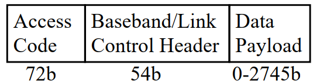
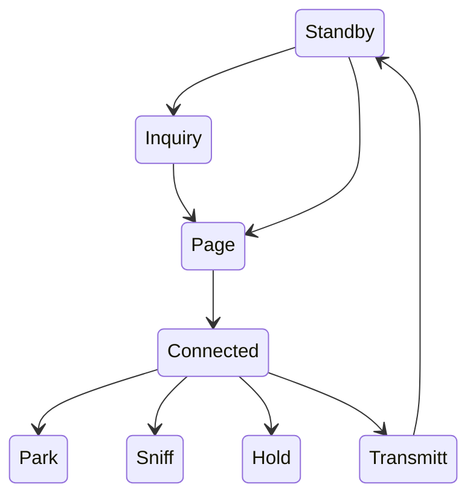

# Bluetooth Packet Format
## รูปแบบ packet ของ Bluetooth

- แพ็คเก็ตสามารถมีความยาวได้ถึง 5 ช่อง 
  - 5 ช่อง = 3125 บิต
- รหัสการเข้าถึง: 
  - รหัสการเข้าถึงช่องระบุพิโคเน็ต (piconet)
  - รหัสการเข้าถึงอุปกรณ์สำหรับการร้องขอการเรียกเพจและการตอบสนอง (paging requests and response)
  - รหัสการเข้าถึงการสอบถามเพื่อค้นหาอุปกรณ์ (discover units)
- ส่วนหัว: 
  - member address (3b), 
  - type code (4b), flow control, ack/nack (1b), 
  - sequence number, and header error check (8b) 
  - 18b Header is encoded using 1/3 rate FEC resulting in 54b
- ทราฟฟิกแบบซิงโครนัสจะมีช่องสำรองเป็นระยะๆ
- สามารถจัดสรรช่องอื่นๆ สำหรับทราฟฟิกแบบอะซิงโครนัสได้

## States การทำงานของ Bluetooth

สถานะ | รายละเอียด
-|-
Standby| สถานะเริ่มต้น
Inquiry| <li> master จะส่งชุดคำถาม (inquiry packet) <li> slaves จะสแกน คำถามและตอบกลับพร้อมที่อยู่และนาฬิกาหลังจากมีการหน่วงเวลาแบบสุ่ม (CSMA/CA) เพื่อไม่ให้ข้อมูลชนกัน
Page| <li> master ที่อยู่ในสถานะเพจเชิญอุปกรณ์ให้เข้าร่วมพิโคเน็ต <li>ข้อความ page จะถูกส่งใน 3 ช่องติดต่อกัน (3 ความถี่) <li>slave เข้าสู่สถานะการตอบสนองของ page และส่งการตอบสนองของ page รวมถึงรหัสการเข้าถึงอุปกรณ์ด้วย <li>master แจ้งให้ slave ทราบเกี่ยวกับนาฬิกาและที่อยู่ของตนเพื่อให้slaveสามารถเข้าร่วมในเครือข่าย piconet ได้ โดย slave จะคำนวณค่า offset ของนาฬิกาเพื่อระบุระยะห่าง
Connected|  มีการกำหนดที่อยู่ขนาด  3 บิต
Transmit|

### แผนผัง States การทำงาน

## การจัดการพลังงานใน Bluetooth

เมื่อ connected แล้ว Bluetooth สามารถทำงานได้ใน 4 สถานะประกอบด้วย park, sniff, hold และ transmitt

สถานะที่ประหยัดพลังงานได้แก่    park, sniff, hold นั้น จะช่วยให้อุปกรณ์  bluetooth ช่วยยืดอายุการใช้งาน battery ได้มากขึ้น 

1. Hold: ไม่มีการเชื่อมต่อแบบอะซิงโครนัส (ACL) แต่การเชื่อมต่อแบบซิงโครนัส (SCO) จะยังคงอยู่ โหนดสามารถทำอย่างอื่นได้ ประกอบด้วย scan, paging  และ inquiry
2. Sniff: โหมดพลังงานต่ำ slave จะรับฟังหลังจากช่วงเวลา sniff ที่กำหนด
3. Park: โหมดพลังงานต่ำมาก slave จะสละ member address ขนาด 3 บิต และรับ parked address ขนาด 8 บิต และเข้าสู่โหมด sleep จากนั้นจะตื่นเป็นระยะเพื่อฟังสัญญาณจาก master ที่จะอากาศสัญญาณ  beacons มาเป็นระยะ
