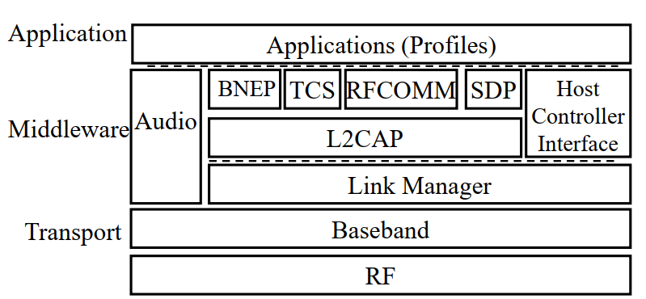
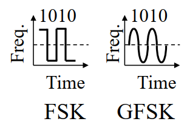

# Bluetooth Protocol Stack
## Bluetooth Protocol Stack

### RF layer
ภาครับส่งสัญญาณวิทยุของ Bluetooth เข้ารหัสแบบ Frequency hopping Gaussian Frequency Shift Keying (GFSK) modulation

### Baseband layer
- ทำหน้าที่ Frequency hop selection, connection, MAC
- อุปกรณ์แต่ละตัวมีที่อยู่ MAC IEEE 48 บิต
- ประกอบด้วย 3 ส่วน:
  - address ด้านล่าง (LAP) – 24 บิต
  - address ด้านบน (UAP) – 8 บิต
  - address ไม่สำคัญ (NAP) – 16 บิต

- UAP+NAP = ตัวระบุเฉพาะขององค์กร (OUI) จาก IEEE
- LAP ใช้ในการระบุ piconet และการทำงานอื่นๆ
- นาฬิกาทำงานที่ 3,200 ครั้ง/วินาทีหรือ 312.5 µs (สองเท่าของอัตรา hop)

### Link Manager
ทำหน้าที่เจรจาพารามิเตอร์ต่าง ๆ กับอุปกรณ์ และตั้งค่าการเชื่อมต่อ

### Logical Link Control and Adaptation Protocol (L2CAP)
ทำหน้าที่
- Protocol multiplexing
- Segmentation and reassembly
- Controls peak bandwidth, latency, and delay variation

### Host Controller Interface

ทำหน้าที่อินเทอร์เฟซชิปบลูทูธเข้ากับ host (อาจจะเป็น microcontroller หรือ host ใดๆ) อนุญาตให้ซอฟต์แวร์เดียวกันทำงานบนชิปทั้งหมด

### RFCOMM
จัดเตรียมการเชื่อมต่อแบบ virtual serial port
- ตั้งค่าการเชื่อมต่อกับ RFCOMM อื่น
 
### Service Discovery Protocol (SDP)
อุปกรณ์สามารถค้นหาบริการที่นำเสนอและพารามิเตอร์ของบริการเหล่านั้น

### Bluetooth Network Encapsulation Protocol (BNEP)
มีไว้เพื่อส่งแพ็คเก็ตอีเทอร์เน็ต/IP ผ่านบลูทูธ

### IrDA Interoperability protocols
อนุญาตให้แอปพลิเคชัน IrDA ที่มีอยู่ทำงานได้โดยไม่ต้องมีการเปลี่ยนแปลง การแลกเปลี่ยนวัตถุ IrDA (IrOBEX) และการสื่อสารเคลื่อนที่ด้วยอินฟราเรด (IrMC) สำหรับ

### Audio
เสียงจะถูกส่งผ่าน 64 kbps ผ่านลิงก์ SCO ผ่านเบสแบนด์

### Telephony control specification binary (TCS-BIN)
การควบคุมการโทรรวมถึงการจัดการกลุ่ม (ส่วนขยายหลายส่วน การส่งต่อสาย และการโทรกลุ่ม)

### Application Profiles
ชุดอัลกอริทึม ตัวเลือก และพารามิเตอร์

## ตัวอย่าง Application Profile

- Headset Profile
- Global Navigation Satellite System Profile
- Hands-Free Profile
- Phone Book Access Profile
- SIM Access Profile
- Synchronization Profile
- Video Distribution Profile
- Blood Pressure Profile
- Cycling Power Profile
- Find Me Profile
- Heart Rate Profile
- Basic Printing Profile
- Dial-Up Networking Profile
- File Transfer Profile

### references
https://www.bluetooth.com/specifications/specs/core-specification-6-0/