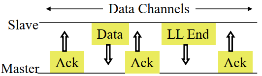

# Bluetooth Smart
## Bluetooth Smart

## คุณสมบัติ

คุณสมบัติ|รายละเอียด
-|-
พลังงานต่ำ|กินกำลัง 1% ถึง 50% ของ Bluetooth classic
เหมาะสำส่งข้อมูลรยะสั้น | <li>อุณหภูมิร่างกาย <li>อัตราการเต้นของหัวใจ<li> อุปกรณ์สวมใส่<li>เซ็นเซอร์<li>ยานยนต์ <li>อุตสาหกรรม<li>ไม่เหมาะสำหรับเสียง/วิดีโอ หรือการถ่ายโอนไฟล์
ข้อความขนาดเล็ก| อัตราข้อมูล 1Mbps แต่ปริมาณข้อมูลไม่ใช่เรื่องสำคัญ 
อายุแบตเตอรี่| เป็นปีจากแบตเตอรี่ชนิดเหรียญ
ง่าย| โทโพโลยีแบบดาว ไม่มีเครือข่าย scatter หรือ mesh
ต้นทุนต่ำ| ราคาถูกกว่า Bluetooth classic
รองรับสมาร์ทโฟนใหม่ทั้งหมด|  iPhone, Android, ฯลฯ 

## Bluetooth Smart PHY
- ความถี่ 2.4 GHz. ระยะทาง 150 เมตร ในที่โล่ง
- Star topology
- 1 Mbps Gaussian Frequency Shift Keying ดีกว่า n Bluetooth classic
- Adaptive Frequency hopping. 40 ช่องสัญญาณ ที่ระยะห่าง 2 MHz
- สำรองไว้ 3 ช่องสำหรับ advertising และอีก 37 ช่องไว้สำหรับ data
- ช่อง Advertising จะถูกคัดเลือกอัตโนมัติ เพื่อไม่ให้รบกวนกับช่องสัญญาณ Wi-Fi

## Bluetooth Smart MAC

- ในระบบมีอุปกรณ์สองชนิดคือ `Peripherals` และ `central` 
    - `Peripherals` มีความซับซ้อนน้อยกว่า  
- มี PDU สองชนิด คือ  Advertising, Data
- Non-Connectable Advertising: เผยแพร่ข้อมูลอย่างชัดเจน
- Discoverable Advertising:อุปกรณ์ส่วนกลางอาจขอข้อมูลเพิ่มเติม อุปกรณ์ต่อพ่วงสามารถส่งข้อมูลได้โดยไม่ต้องเชื่อมต่อ
- General Advertising: การเผยแพร่ที่ต้องการเชื่อมต่ออุปกรณ์ส่วนกลางอาจขอการเชื่อมต่อสั้นๆ
- Directed Advertising: ส่งข้อมูลที่ลงนามไปยังอุปกรณ์หลักที่เชื่อมต่อไว้ก่อนหน้านี้

- หลังจากเชื่อมต่อแล้ว master จะแจ้ง slave เกี่ยวกับลำดับการ hopping และ
wake up cycle
- การถ่ายโอนข้อมูลทั้งหมดจะเกิดขึ้นใน 37 ช่องข้อมูลที่เหลือ
- อุปกรณ์ทั้งสองฝั่ง สามารถเข้าสู่โหมด sleep ระหว่างการทำ transactions
- ข้อมูลสามารถเข้ารหัสได้
- สามารถทำ transaction ได้ครั้งละประมาณ 3 ms ,โดยใช้พลังงาน 15 mW   หรือกินกระแส 10 mA เมื่อใช้ถ่าน 1.5V
    - 30mAs/transaction
    - 21.6 M transactions โดยใช้แบตเตอรี่ 180 mAh battery
    - ใช้ได้นาน 41.1 ปี เมื่อทำ 1 transaction/นาที

### Advertising Channel

### Data Channels

## Bluetooth Smart Protocol Stack

## References

https://californiaconsultants.org/wp-content/uploads/2014/05/CNSV-1205-Decuir.pdf